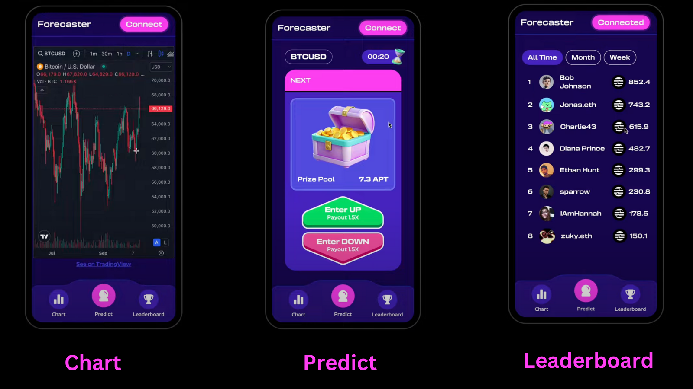

# Forecaster
The Mobile-First Prediction market to bet on BTC prices every 5 minutes, built on Aptos ✨

Track : **The Unexpected**

Bounty: **The UI Challenge**

Deployed on : [Aptos Testnet](https://explorer.aptoslabs.com/account/0x2a12be72eb760dc3bd69017173f7245567ce8b8dada77d5c4eefddbe22fe13a5/transactions?network=testnet)

## Description
**Forecaster** is a decentralized prediction market built on the Aptos blockchain that allows users to bet on Bitcoin price movements. The platform operates by resolving bets every five minutes, providing a dynamic and engaging experience for users interested in cryptocurrency price speculation. Utilizing Aptos' advanced features, Forecaster ensures secure, efficient transactions and real-time updates through integration with the Pyth network for accurate price feeds.

## Why users will love Forecaster on Aptos
  - Mobile First
  - Gamified 3d UI
  - Super fast settlements
  - Decentralized Prediction Market

## The Forecaster Dapp

## User Guide
- Create a [Petra Wallet](https://petra.app).
- Fund your wallet with [APT](https://developers.moralis.com/faucets/utm_source=blog&utm_medium=post&utm_campaign=Aptos%2520Testnet%2520Faucet%2520%25E2%2580%2593%2520How%2520to%2520Get%2520Testnet%2520APT%2520from%2520an%2520Aptos%2520Faucet).
- Visit [Forecaster](https://forecaster-aptos.vercel.app).
- Click on Connect Wallet.
- Click on the Green arrow button to bet up or Click on the Red arrow button to bet down.This will place your bets on the Aptos blockchain.
- Note :The betting on the bitcoin price is to predict if the price of BTC will move up or down then the previous closing round.You can also check the price chart and leaderboard within the dapp.
- Each round lasts for 5 minutes during which the bets can be placed. Once the timer runs out, the market is resolved and the winners can claim their winning funds. 

## Key UI
- The colors were carefully chosen to dark mode for users playing longer.
- The brand kit of #17074E #4722BF #FF3EF2 offering a playful interface was chosen.
- The bright red and green buttons sizes were made larger to accomodate nudges of mobile users with smaller screens after taking feedback from the community.
- The display of a running timer at the top-right to create FOMO and motivate users to bet.
- A confetti animation during a user's win to celebrate the accomplishment.

### Aptos Blockchain 
Forecaster is designed in a way such that there is always something to bet on. The near instant settlement offered by Aptos is perfect for this since the users expect it so that they can reuse their winning funds on the next bet. This was a primary reason to choose Aptos to build on, along with a strong community.
- **High Throughput**: The platform can handle higher number of transactions per second, ensuring that multiple users can place bets without congestion.
- **Instant Settlement**:Instant settlement to encourage users to bet over long time.
- **Smart Contract Functionality**: Utilizing Move, Aptos' programming language, Forecaster implements secure and efficient smart contracts that govern all betting activities.

### The Tech 
- **The Code**: The frontend is developed using Next.js and the design was developed on Figma.The smart contracts are written in Move, focusing on security and efficiency. Comprehensive error handling and assertions are in place to prevent misuse.
- **Complexity of Technology**: Forecaster utilizes advanced features such as user bet tracking, dynamic round management, and automated reward distribution.
- **Integration with Pyth Network**: Real-time price feeds from Pyth ensure that users have access to the most accurate Bitcoin prices, gain the reliability of the prediction market.

### Innovation
- **Real-time Betting**: Users can place bets based on real-time data, allowing for a more interactive experience compared to traditional betting platforms. They can also pull up the charts for a price action study to make calculated decisions. 
- **Frequent Resolution Intervals**: The five-minute resolution period keeps users engaged and encourages frequent participation.

### Project  
- **User Interface**: An intuitive interface that allows users to easily navigate and place bets.
- **Functionality**: Fully implemented features including bet placement, round resolution, and reward claims.
- **Testing on Aptos Testnet**: The project has been tested and deployed on the Aptos testnet.
  
### Future Potential
- **Scalability**: The architecture is designed to accommodate an increasing number of users and transactions as demand grows.The future plans to implement referral based NFTs that unlock super powers to increase the user base is out go-to-market strategy.
- **Community Engagement**: Plans for community-driven features such as governance tokens or rewards for active participants can enhance user loyalty and platform adoption.
- **Expansion Opportunities**: Plans to launch the dapp natively multi-lingual to boost user participation.

### The Team
- **Stefano**: Design & Front end Developer
- **Hema**: Smart Contract Developer

## The Plan

Fantasy gaming based prediction market was our initial idea. We came to know about the hack just 4 days before, so we managed to pull an idea to code of the betting market on btc pricing.Had we known about the hack earlier,we would have chosen our elaborate idea. 

We plan to get grants for developer time and infra to expand the project to the Aptos mainnet by the end Q1 2025.

Focusing on long term on Forecaster , we plan to include
- Lottery page with scratch cards
- Price prediction based on other crypto prices by introducing gamified experience where usage unlocks NFTs with super-powers like increased multiplier to the winnings when the user bets.
- Improved animation and UX with account abstraction.
- NFT based rewards for referrals to the dapp that unlock gas sponsorshop for the bets places.
  

